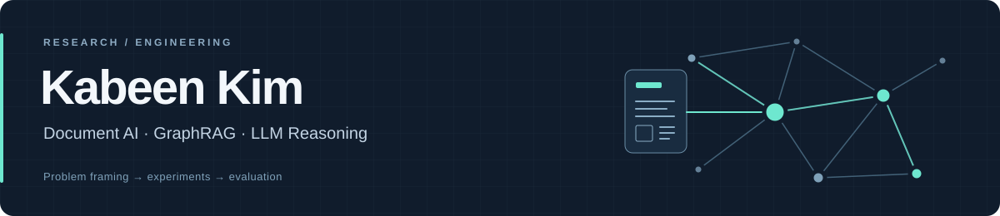

  <a href="https://kbannie.github.io/"><b>Website</b></a> &nbsp;·&nbsp;
  <a href="https://scholar.google.com/citations?user=_GZ1nzIAAAAJ&amp;hl=en">Google Scholar</a> &nbsp;·&nbsp;
  <a href="https://www.linkedin.com/in/kabeen-kim-6806b8221/">LinkedIn</a> &nbsp;·&nbsp;
  <a href="https://kbannie.github.io/KabeenKim_CV.pdf">CV</a> &nbsp;·&nbsp;
  <a href="mailto:sunk2205@duksung.ac.kr">Email</a>

I'm **Kabeen**, an undergraduate studying **Computer Engineering and Information Statistics** at Duksung Women's University. I work on document understanding, retrieval-augmented generation, and LLM reasoning.

I care about how models fail, which evidence they retrieve, and how to design experiments that explain their behavior.

- **Recent focus:** multi-hop GraphRAG over knowledge graphs, including path-preserving search and evidence reranking at **ETRI**.
- **Highlight:** **3rd place out of 210 teams**, 2025 Samsung AI Challenge — Visually-Rich Document Understanding, with [CoDU](https://github.com/kbannie/CoDU).

## Selected research

<table>
<tr>
<td width="50%" valign="top">
<h3>UDAPose</h3>

COMPUTER VISION · CVPR 2026

Unsupervised domain adaptation for human pose estimation in low-light images.

Haopeng Chen, Yihao Ai, <b>Kabeen Kim</b>, Robby T. Tan, Yixin Chen, Bo Wang

<a href="https://arxiv.org/abs/2604.10485"><b>Paper →</b></a> &nbsp; <a href="https://github.com/Vision-and-Multimodal-Intelligence-Lab/UDAPose">Official code →</a>

</td>
<td width="50%" valign="top">
<h3>ConFuse</h3>

LLM + TABULAR LEARNING · ICTC 2026, ACCEPTED

Context-aware fusion of GBDT and fine-tuned LLM predictions for sleep prediction from lifelog data.

<b>Kabeen Kim*</b>, Yena Kim*, Minjeong Seo* &nbsp;(*equal contribution)

<a href="https://github.com/kbannie/ConFuse"><b>Code &amp; experiments →</b></a>

</td>
</tr>
<tr>
<td width="50%" valign="top">
<h3>CoDU</h3>

DOCUMENT UNDERSTANDING · KDBC 2025

Multi-stage document parsing with layout detection, OCR, formula recognition, and reading-order reconstruction.

🏆 <b>3rd / 210 teams</b>, 2025 Samsung AI Challenge

<b>Kabeen Kim</b>, Minhye Lee, Haein Seo, Jehyeok Rew

<a href="https://github.com/kbannie/CoDU"><b>Code &amp; models →</b></a>

</td>
<td width="50%" valign="top">
<h3>SPTC</h3>

LLM REASONING · KCC 2025

A single-pass tree-based prompting scheme for efficient reasoning with small language models.

<b>Kabeen Kim</b>, Jiye Park, Jehyeok Rew

<a href="https://www.dbpia.co.kr/journal/articleDetail?nodeId=NODE12318736"><b>Paper →</b></a>

</td>
</tr>
</table>

**Applied AI:** [DS Chatbot](https://github.com/kbannie/RAG_DS_Chatbot) — a RAG assistant for university regulations, built with LangChain, Pinecone, and Streamlit.

## Experience

| Organization | Role | Focus |
| :--- | :--- | :--- |
| **ETRI** | Research Intern Jul – Aug 2026 | Knowledge graphs & multi-hop GraphRAG |
| **Boston Consulting Group** | Research Analyst Intern Mar – May 2026 | Industrial data analysis & LLM workflows |
| **DMKD Lab, Duksung Women's University** | Undergraduate Researcher Mar 2025 – Feb 2026 | LLM reasoning & document understanding |
| **University of Mississippi** | Undergraduate Researcher Aug 2024 – Feb 2025 | Low-light human pose estimation |

Full timeline and publications: <a href="https://kbannie.github.io/">academic homepage</a>.

## Toolkit

| Area | Technologies |
| :--- | :--- |
| **Languages & data** | Python · SQL · C++ · Pandas · NumPy |
| **Machine learning** | PyTorch · Hugging Face Transformers · LoRA / QLoRA · LightGBM · XGBoost |
| **Retrieval & documents** | LangChain · Pinecone · DocLayout-YOLO · PaddleOCR · Pix2Tex |
| **Experiments & infrastructure** | Weights & Biases · Docker · AWS EC2 / S3 · Linux · Git |
